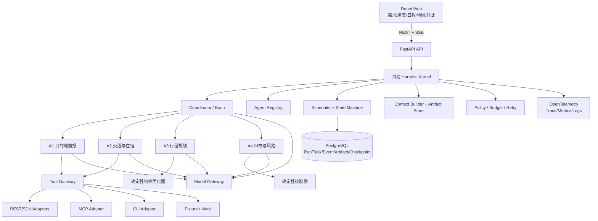
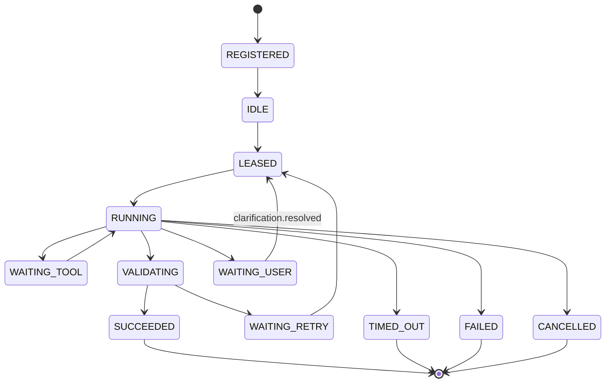
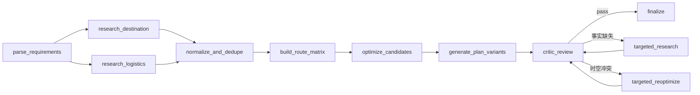

# 基于多 Agent 的智能旅游攻略生成系统——技术实现方案

> 方案版本：v0.1（可执行设计）  
> 更新日期：2026-09-10  
> 前置文档：[需求规格说明书](./01-需求规格说明书.md)  
> 设计目标：自建 Agent Harness，不调用第三方成品 Agent/托管编排接口

## 1. 结论先行

推荐实现为：

**React Web + FastAPI + 自建 Harness Kernel + PostgreSQL + OR-Tools + 可插拔 Model Gateway + 可插拔 Tool Gateway。**

首版不使用 LangGraph 作为核心编排器，不同时引入 Celery 和 Redis。Agent 的生命周期、任务 DAG、消息协议、上下文、工具循环、检查点、预算、审校返工和最终汇总均由本项目代码实现。

外部能力的接入顺序是：

1. 官方 REST API / SDK：在线服务主链路。
2. 官方 CLI：本地联调、批处理、演示和运维。
3. MCP：作为 Tool Gateway 下的可插拔协议适配器。
4. 网页读取：仅补充公开、允许访问且可引用的信息；不承担实时库存和价格。

“自己做 Agent”不等于自己训练基础大模型。系统仍需要一个模型生成端：可以调用普通模型 API，也可以用 Ollama/vLLM 运行本地模型；关键是只使用底层模型推理与 tool calling，Agent 主循环和协作完全掌握在自己的 Harness 中。

## 2. 设计原则

- **确定性优先**：金额、日期、开放时间、路线矩阵、时间窗和 schema 由代码校验。
- **LLM 负责判断**：需求理解、候选解释、方案风格、冲突归因和自然语言表达。
- **结构化协作**：Agent 通过 Task、Event、Artifact 通信，不直接共享整段聊天或自由互聊。
- **总控持有最终答复权**：专家只提交有边界的产物，Coordinator 决定下一步并汇总。
- **证据与结论分离**：外部事实不可被 Agent 原地改写；只能引用、拒绝或标记冲突。
- **供应商隔离**：上层只看到 `places.search`、`route.matrix` 等内部工具名。
- **至少一次语义**：队列、网络和 Worker 都可能重复执行，所有步骤必须支持幂等。
- **渐进式复杂度**：先做单进程、可恢复的 MVP，再增加 Redis/Temporal/Celery 等执行层。

## 3. 总体架构



### 3.1 为什么需要总控 Brain

需要。没有总控时，四个 Agent 会重复查询、互相覆盖状态，无法清楚决定“谁修复哪个问题”，也难以控制成本与终止条件。

但总控不是无所不能的超级 Agent：

- 状态迁移、依赖、重试、并发、预算和最终硬校验由 Harness 代码控制。
- Coordinator 只负责需求解析、任务拆解建议、返工路由和最终表达。
- Coordinator 没有所有外部工具权限，不能绕开专家和审计链。
- 服务端必须校验它生成的任务 DAG：Agent/任务类型必须注册、依赖必须存在、图必须无环、数量与预算不得超限。

OpenAI 官方把多 Agent 分为 handoff 与 manager 调用 specialists 两类；本项目适合由 manager 保持最终答复所有权的模式，但只借鉴模式，不使用托管 Agent 作为核心。[官方编排说明](https://developers.openai.com/api/docs/guides/agents/orchestration)

## 4. 推荐技术栈与工具

### 4.1 后端

| 工具 | 用途 | 选择理由 |
| --- | --- | --- |
| Python 3.12 | Harness、Agent、数据工具、优化器 | AI/优化/数据生态完整，类型支持足够 |
| FastAPI | REST、SSE、依赖注入、OpenAPI | 与 Pydantic 配合自然，便于前后端契约 |
| Pydantic v2 | Agent/工具/消息 schema | 强制结构化输入输出，生成 JSON Schema |
| SQLAlchemy 2 + asyncpg | 异步数据访问 | 可测试、可迁移、避免手写散乱 SQL |
| Alembic | 数据库迁移 | schema 版本可追踪 |
| PostgreSQL 16+ | 唯一权威状态、任务队列、事件与产物 | 同一事务提交任务状态、Artifact 与 Outbox |
| httpx | 外部 REST 调用 | 异步、连接池、超时配置清晰 |
| tenacity | 有上限的指数退避 | 统一处理 429/5xx/网络错误 |
| OR-Tools | 路线顺序、时间窗、可选景点优化 | 开源、Python 可用；官方有 VRPTW 示例 |
| Typer | 自建 `travelctl` CLI | 同一套 Pydantic 模型生成 CLI 参数 |
| structlog | 结构化日志 | 便于关联 run/task/tool |
| OpenTelemetry | trace、指标、日志关联 | 跨模型、Agent、工具与 HTTP 的统一观测 |

OR-Tools 官方示例证明了用时间矩阵与时间窗约束路线的实现方式；本项目可将其改造成单人多日、可选访问点的 Orienteering/VRPTW 变体。[OR-Tools 时间窗路线](https://developers.google.com/optimization/routing/vrptw)

### 4.2 前端

| 工具 | 用途 |
| --- | --- |
| React + TypeScript + Vite | 单页 Web 应用 |
| Ant Design | 表单、步骤条、表格、抽屉、时间轴 |
| TanStack Query | API 缓存、失效和运行状态请求 |
| Zustand | 当前编辑方案与地图联动的轻量状态 |
| Zod | 前端表单与后端 schema 的边界校验 |
| 高德 JS API 2.0 | 中国大陆 MVP 的底图、点位、路线展示 |
| MapLibre GL JS | 全球/自有合法瓦片的可选渲染器 |
| Recharts | 预算和评分对比 |
| Vitest + React Testing Library | 前端单元/组件测试 |
| Playwright | 端到端流程、地图以外的 UI 回归 |

MapLibre GL JS 是 WebGL 矢量地图渲染库，不自带可自由生产使用的底图；使用时必须另选合法瓦片服务。[MapLibre 官方文档](https://maplibre.org/maplibre-gl-js/docs/)

### 4.3 工程工具

- `uv`：Python 依赖和虚拟环境。
- `pnpm`：前端包管理与 monorepo 脚本。
- Ruff + mypy：格式、lint 与类型检查。
- Pytest + pytest-asyncio + respx + Hypothesis：单元、HTTP Mock 与性质测试。
- Docker Compose：PostgreSQL、API、Worker、Web 的本地环境。
- GitHub Actions 或其他 CI：lint、类型、测试、构建与迁移检查。
- `travelctl`：本项目自己的统一 CLI，保证开发、演示、重放和评测不依赖 GUI。

## 5. 建议目录结构

```text
.
├─ apps/
│  ├─ api/                         # FastAPI 入口、REST、SSE
│  ├─ worker/                      # 任务租约与 Agent worker
│  └─ web/                         # React 前端
├─ packages/
│  ├─ domain/                      # Trip/Place/Route/Plan/Evidence 模型
│  ├─ harness/
│  │  ├─ kernel/                   # 状态机、生命周期、运行循环
│  │  ├─ scheduler/                # DAG、租约、重试、取消
│  │  ├─ messaging/                # Event/Task/Artifact 协议
│  │  ├─ context/                  # 上下文选择与压缩
│  │  ├─ policy/                   # 权限、预算、终止条件
│  │  └─ checkpoints/              # 保存与恢复
│  ├─ agents/
│  │  ├─ coordinator/
│  │  ├─ destination_research/
│  │  ├─ mobility_and_stay/
│  │  ├─ itinerary_planner/
│  │  └─ critic/
│  ├─ model_gateway/               # OpenAI/Ollama/vLLM/Scripted adapters
│  ├─ tool_gateway/
│  │  ├─ registry.py
│  │  ├─ policy.py
│  │  ├─ adapters/
│  │  │  ├─ amap_rest/
│  │  │  ├─ baidu_rest/
│  │  │  ├─ qweather_rest/
│  │  │  ├─ open_meteo_rest/
│  │  │  ├─ duffel_rest/
│  │  │  ├─ booking_rest/
│  │  │  ├─ mcp/
│  │  │  ├─ cli/
│  │  │  └─ fixture/
│  │  └─ normalized_models.py
│  ├─ optimizer/                   # 候选筛选、矩阵、OR-Tools、预算
│  ├─ validators/                  # 硬约束、证据、schema、坐标
│  └─ rendering/                   # Markdown/JSON/ICS/PDF 转换
├─ skills/                         # 自有可复用 Agent Skills
│  ├─ destination-research/SKILL.md
│  ├─ itinerary-review/SKILL.md
│  └─ travel-source-policy/SKILL.md
├─ migrations/
├─ tests/
│  ├─ unit/
│  ├─ integration/
│  ├─ contract/
│  ├─ e2e/
│  ├─ chaos/
│  └─ evals/
├─ fixtures/                       # 合法、脱敏、版本化的供应商响应
├─ docs/
├─ infra/
├─ .env.example
├─ pyproject.toml
├─ pnpm-workspace.yaml
└─ compose.yaml
```

## 6. 自建 Harness 的具体实现

### 6.1 核心对象

```python
class AgentSpec(BaseModel):
    agent_id: str
    version: str
    instructions_ref: str
    input_schema: str
    output_schema: str
    tool_allowlist: list[str]
    model_policy: str
    max_steps: int = 8
    timeout_seconds: int = 60
    token_budget: int
    retry_policy: RetryPolicy

class TaskEnvelope(BaseModel):
    schema_version: str = "1.0"
    run_id: str
    task_id: str
    task_type: str
    recipient_agent: str
    dependency_ids: list[str]
    input_artifact_refs: list[str]
    attempt: int
    deadline: datetime
    idempotency_key: str
    trace_id: str

class Artifact(BaseModel):
    artifact_id: str
    run_id: str
    artifact_type: str
    schema_version: str
    producer_agent: str
    parent_artifact_ids: list[str]
    content_hash: str
    payload: dict
    created_at: datetime

class ToolResult(BaseModel):
    call_id: str
    status: Literal["ok", "partial", "error"]
    data: dict | None
    error: ToolError | None
    source_refs: list[SourceRef]
    retrieved_at: datetime
    provider_request_id: str | None
    latency_ms: int
    cache_hit: bool
```

`Artifact` 保存大结果，消息只传引用，避免 POI 列表、路线矩阵和网页正文反复进入每个 Agent 的上下文。这里的“保存”受 Provider 字段级 `storage_policy` 约束：无持久化许可的原始响应只存在于内存或供应商允许的短生命周期缓存中，Artifact 只保存允许字段、引用/哈希和项目自己生成的内容。

### 6.2 Agent 生命周期



### 6.3 Agent 主循环

Harness 自己实现如下有限循环，而不是交给第三方 Runner：

```python
async def execute_agent_task(task_id: str) -> None:
    task = await lease_task(task_id)
    spec = await agent_registry.get(task.recipient_agent)
    context = await context_builder.build(task, spec)

    for step in range(spec.max_steps):
        await enforce_run_budget(task.run_id, spec)
        await checkpoint(task, step, context)

        turn = await model_gateway.generate(
            messages=context.messages,
            tools=tool_registry.schemas(spec.tool_allowlist),
            output_schema=spec.output_schema,
            policy=spec.model_policy,
        )

        if turn.tool_calls:
            for call in turn.tool_calls:
                checked = tool_policy.validate(spec, call)
                result = await tool_gateway.execute(checked, task)
                context = context.with_tool_result(call, result)
            continue

        artifact = validate_and_build_artifact(turn.output, spec)
        await commit_success_with_outbox(task, artifact)
        return

    await fail_task(task, code="MAX_STEPS_EXCEEDED")
```

关键点：

- 模型只能“请求”工具，真正执行、权限和参数验证由应用完成；这也是底层 function calling 的基本模式。[OpenAI Function Calling](https://developers.openai.com/api/docs/guides/function-calling)
- 每个 step 之前保存检查点并检查取消/预算。
- 工具先写 `tool_call.planned`，执行后写 `tool_call.completed`。
- 结构化输出修复最多一次，失败后重跑当前任务而不是无限提示。
- 不保存或展示模型私有思维链，只保存结构化决定、工具调用、简短理由与审计事件。

### 6.4 状态机与任务 DAG

Run 状态：

```text
CREATED → PARSING → RESEARCHING → PLANNING → REVIEWING
        → REVISING（最多 2 轮）→ FINALIZING → COMPLETED

任意运行态可转：WAITING_USER / PARTIAL / FAILED / CANCELLED / TIMED_OUT
```

典型任务图：



### 6.5 Agent 之间如何交互

不允许 Agent 直接互调，也不把其他 Agent 的全部对话历史塞入上下文。统一使用事件与 Artifact：

```json
{
  "schema_version": "1.0",
  "event_id": "evt_...",
  "event_type": "task.assigned",
  "run_id": "run_...",
  "task_id": "task_...",
  "correlation_id": "run_...",
  "causation_id": "evt_parent_...",
  "sender": "orchestrator",
  "recipient": "destination_research",
  "attempt": 1,
  "created_at": "2026-09-10T10:00:00+08:00",
  "deadline": "2026-09-10T10:01:00+08:00",
  "idempotency_key": "sha256:...",
  "payload": {
    "objective": "collect_destination_evidence",
    "input_artifact_refs": ["artifact_trip_brief"],
    "constraints": {"max_candidates": 30}
  },
  "trace": {"trace_id": "...", "span_id": "..."}
}
```

最低事件集合：

`run.created`、`plan.created`、`task.assigned`、`task.started`、`task.progress`、`tool_call.planned`、`tool_call.completed`、`artifact.published`、`artifact.rejected`、`review.verdict`、`task.retry_scheduled`、`task.failed`、`task.cancelled`、`task.timed_out`、`clarification.requested`、`clarification.resolved`、`run.completed`、`run.partial`、`run.failed`、`run.cancelled`、`run.timed_out`。

`correlation_id` 把整个运行串起来，`causation_id` 说明某次审校如何触发后续返工，便于可视化和重放。消费者以 `event_id` 幂等；同一事件重复投递只能更新同一投影，不能重复创建任务或执行副作用。

## 7. 1+4 Agent 的实现细节

### 7.1 Coordinator / Brain

内部节点：

- `RequirementParser`：用户文本 → `TripBrief`。
- `DAGPlanner`：根据行程复杂度启用核心/扩展 Agent。
- `DispatchPolicy`：并行度、deadline、token、工具调用预算。
- `ConflictRouter`：把问题路由到事实、物流、规划或用户。
- `FinalAggregator`：基于已验证 Artifact 生成 `FinalPlanBundle`。最终 UI、Markdown 和 JSON 默认由确定性模板渲染；若启用 LLM 语言润色，输入只包含 claim/evidence ID 与已验证字段，润色结果必须再次通过引用完整性校验，失败时回退到确定性模板。

Coordinator 的最终合并规则：

1. 硬约束高于偏好和评分。
2. 路线矩阵高于 LLM 的路程估算。
3. 直接官方数据高于二手内容。
4. 动态数据优先 `valid_at/retrieved_at` 更新者。
5. 无法解决的冲突保留区间/不确定性，不取平均伪装成确定值。
6. Coordinator 不能修改原始 claim，只能选用、拒绝或标注。
7. Critic 通过后仍需执行最终确定性校验。

### 7.2 A1 目的地情报 Agent

任务：召回景点、餐厅、街区、活动、开放信息、天气适配与备选项。供应商事实与推断字段分开保存；“建议游玩时长”使用 `visit_duration_estimate {method, range, confidence}`，不能伪装成地图供应商提供的事实，价格允许为 `unknown`。

允许工具：

- `places.search`
- `places.details`
- `weather.forecast`
- `public_page.read`（严格域名白名单）
- `entity.resolve`

输出 `DestinationResearchArtifact`，每个事实带 provider、来源、时间、坐标系、置信度和冲突状态。它不安排最终日程。

### 7.3 A2 交通与住宿 Agent

任务：住宿区域与候选、城际交通候选、市内交通模式/换乘约束、入住/退房、价格区间与衔接风险。它不生成全量 POI 路线矩阵；矩阵必须等 A1/A2 候选合并去重后由 Harness 的确定性 `build_route_matrix` 任务生成。

允许工具：

- `routes.compute`（仅用于酒店/枢纽等已有端点的定向核验）
- `lodging.search`
- `flight.search`
- `rail.official_link`
- `currency.convert`

MVP 中实时住宿/航班适配器可关闭，Agent 必须能基于 Fixture 或“无实时数据”正常退化。

### 7.4 A3 行程规划 Agent

任务：提出候选方案主题和解释，调用确定性优化器，不访问开放互联网。

允许工具：

- `optimizer.solve`
- `budget.calculate`
- `schedule.validate`
- `plan.variant`

输出一个 `PlanCandidatesArtifact`，其中包含 2～3 个 `ItineraryVersion`。每个行程项只能引用已经存在的 place/route/claim ID。

### 7.5 A4 审校与风险 Agent

评分建议：

- 可执行性：35%
- 偏好匹配：25%
- 预算吻合：20%
- 风险与备选：10%
- 证据完整/新鲜：10%

输出必须是机器可执行的 `CritiqueArtifact`：

```json
{
  "verdict": "revise",
  "scores": {"feasibility": 0.82},
  "hard_violations": [
    {
      "code": "OPENING_HOURS_CONFLICT",
      "plan_item_id": "item_...",
      "evidence_ids": ["evi_..."],
      "severity": "error"
    }
  ],
  "patch_requests": [
    {
      "target_agent": "itinerary_planner",
      "action": "replace_item_same_area",
      "constraints": {"day": 2, "max_extra_travel_min": 15}
    }
  ]
}
```

返工路由：事实缺失 → A1；路线、住宿、班次 → A2；排序与文案 → A3；用户需求自相矛盾 → Coordinator 暂停询问。

## 8. 规划与优化算法

### 8.1 数据处理流水线

1. 使用供应商 ID、名称、地址、坐标和类别进行实体去重。
2. 保留原始坐标及 `coord_system`，转换后再参与矩阵计算。
3. 硬约束事实按 `verified | contradicted | unknown` 三态处理：`contradicted` 直接排除；强制约束为 `unknown` 时 fail-closed 并要求确认；非强制未知项进入风险区，不能被当作已满足。
4. 候选评分：兴趣、质量、天气、费用、距离、多样性和新鲜度。
5. 每类只保留 Top-K，控制路线矩阵调用量和求解规模。
6. 获取真实路线时间矩阵；失败时只能使用带 `estimated` 标记的保守估算。高德国内接口并非天然提供任意 NxN 矩阵，Adapter 需按接口能力把 origins/destination 分批组合，设置调用量上限并在超额时降低 Top-K；步行等模式还要检查供应商距离限制和缓存许可。
7. 调用 OR-Tools 生成可行顺序和时间窗。
8. 用确定性校验器重新计算所有时间、预算和引用。
9. 通过改变权重/约束生成均衡、经济、轻松三种方案，而不是只改文案标题。

### 8.2 目标函数示例

```text
maximize
  0.30 * preference_match
+ 0.15 * place_quality
+ 0.10 * diversity
+ 0.10 * weather_fit
+ 0.10 * evidence_freshness
- 0.15 * travel_time_penalty
- 0.05 * budget_overrun_penalty
- 0.05 * schedule_density_penalty
```

硬约束不能通过降低惩罚权重被违反。价格未知时不以 0 元处理，而是从硬预算判定中排除并增加不确定性警告。

### 8.3 时间模型

每项活动：

```text
start_at
+ visit_duration
+ route_duration_to_next
+ mode_buffer
+ uncertainty_buffer
<= next_start_at
```

建议默认缓冲：步行/市内 10～15 分钟，机场/火车站单独按用户与交通类型配置。所有时间使用带时区的 ISO-8601。

## 9. 数据源、API、CLI、MCP 与 Skills 选型

### 9.1 供应商矩阵

| 能力 | MVP 首选 | 备用/后续 | 接入形式 | 结论 |
| --- | --- | --- | --- | --- |
| 中国大陆地图/POI/路线 | 高德 Web Service + 高德 JS API | 百度 Web API | 后端 REST + 前端 SDK | 生产主链；同一运行不混用坐标基准 |
| 海外地图/POI/路线 | Mapbox 或 Google Maps | 自托管 OSM 栈 | REST/SDK | 按地区、许可和预算选择 |
| 天气 | QWeather 或高德天气 | Open-Meteo / OpenWeather 中国节点 | REST | Open-Meteo 免费层适合非商业原型且需署名 |
| 航班 | Fixture；可选 Duffel Test/Live | 企业级 GDS/OTA | REST | 测试模式不是真实时刻/价格 |
| 铁路 | 用户输入 + 12306 官方跳转 | 明确授权的商业 Provider | 深链/适配器 | 不逆向、不模拟登录、不自动购票 |
| 酒店推荐 | 高德酒店 POI/区域 | Booking Demand API | REST | POI 不是实时库存；Booking 需合作准入 |
| 景点门票 | 官方景点链接 | Viator/Booking Attractions 合作接口 | REST/跳转 | 未获批准时不声称实时可订 |
| 餐厅/景点口碑 | 地图 POI 字段 | 用户提供内容/授权数据 | REST/导入 | 不抓取小红书、大众点评笔记与评论 |

高德 Web Service 已覆盖地理编码、POI、路线和天气，路线 2.0 支持多种交通方式。[高德 Web Service](https://lbs.amap.com/api/webservice/summary) / [路径规划 2.0](https://lbs.amap.com/api/webservice/guide/api/newroute)

高德 POI 2.0 可提供评分、参考消费、营业时间、电话和图片等字段，但不代表酒店/门票实时库存。[高德 POI 2.0](https://lbs.amap.com/api/webservice/guide/api-advanced/newpoisearch)

个人开发者权益中的不同接口配额差异很大，部分 POI/输入提示能力可能只有约 100 次/日，而常规编码和路线通常更高；P0/E0 必须以账号控制台的实际权益为准，限制候选数量并准备 Fixture，不能按“所有地图接口都有大额免费额度”设计。[高德开发者权益与调用配额](https://lbs.amap.com/faq/account/certification/39670)

### 9.2 地图 CLI 的准确判断

截至 2026-09，高德已经提供官方 CLI、MCP 和 Skills：

- CLI：`npm install -g @amap-lbs/amap-gui`，支持 `amap-gui route ...` 等命令，并启动地图 GUI 容器。[官方 CLI 安装](https://lbs.amap.com/api/cli/map-cli/install)
- MCP：支持 Streamable HTTP 与 Node stdio，覆盖编码、POI、天气和多种路线能力。[高德 MCP](https://lbs.amap.com/api/mcp-server/summary)
- Skills：属于说明、脚本和工作流封装，仍需要 API Key。[高德 Skills](https://lbs.amap.com/api/skill/ready-to-use/summary)

因此不能再说“地图厂商没有 CLI”。但高德 CLI 偏地图 UI 控制与演示，依赖本地 GUI/JS API Key，不适合作为 FastAPI 后端的稳定数据契约。推荐：

- 线上规划：高德 REST Adapter。
- 前端展示：高德 JS API。
- 开发/答辩演示：高德 CLI 可作为额外工具。
- 通用 MCP 客户端兼容：高德/百度 MCP Adapter，可随配置启用。

百度已有官方 MCP，支持远程 Streamable HTTP 和 Python/Node 本地方式。[百度 MCP 快速开始](https://lbs.baidu.com/docs/ai?title=mcpserver%2Fquickstart)

Google Maps 的 Routes/Places 主接入仍是 REST/SDK。Mapbox 当前有官方 MCP，但旧 Python CLI 已归档；海外链路依然建议以 REST/SDK 为主，不能把“有 CLI/MCP”本身当作数据质量或运行稳定性的证明。[Mapbox MCP](https://docs.mapbox.com/location-ai/mcp-servers/mcp-server/) / [Mapbox 旧 CLI 仓库](https://github.com/mapbox/mapbox-cli-py)

OpenStreetMap 可作为海外自托管数据基础，但公共 Nominatim 和 `tile.openstreetmap.org` 有严格用量政策且无生产 SLA，不应被当作免费的无限量后端；毕业设计若不准备维护 Nominatim、OSRM 和瓦片基础设施，就选择有授权的托管供应商。[Nominatim Policy](https://operations.osmfoundation.org/policies/nominatim/) / [OSM Tile Policy](https://operations.osmfoundation.org/policies/tiles/)

### 9.3 Amadeus、12306 与小红书修正

- Amadeus 官方首页目前明确 Self-Service portal 已于 **2026-07-17** 下线，默认推荐已不再成立；只有取得 Enterprise 访问时才实现适配器。[Amadeus 官方首页](https://developers.amadeus.com/)
- 12306 官方反复强调其网站/App 是官方票务渠道，本次调研未找到受支持的公开开发者购票 API；项目只做官方跳转或授权 Provider。[12306 官方说明](https://www.12306.cn/mormhweb/zxdt/202412/t20241211_43192.html)
- 小红书公开开放平台主要提供电商/小程序能力，不等于开放笔记搜索数据库；不建立爬虫 Agent。用户主动提供的游记可在得到授权后作为文档输入。

### 9.4 天气、航班、酒店的现实边界

- QWeather 适合中国区域的实况、逐小时/逐日和预警接入。[QWeather API](https://dev.qweather.com/docs/api/weather/)
- Open-Meteo 适合非商业原型，其免费服务有调用限制且数据要求 CC BY 4.0 署名；商业使用需对应计划。[文档](https://open-meteo.com/en/docs) / [许可](https://open-meteo.com/en/license)
- Duffel 提供测试模式，但官方明确测试航司可能不是真实时刻或价格；只用于开发与 Fixture 录制。[Duffel Test Mode](https://duffel.com/docs/api/overview/test-mode)
- Booking Demand API 能提供住宿数据与预订链路，但有合作前置条件；适配器默认关闭。[Booking Demand API](https://developers.booking.com/demand/docs)

### 9.5 坐标与数据许可

内部对象必须携带：

```text
provider
provider_place_id
raw_coordinate
raw_coord_system: WGS84 | GCJ02 | BD09
canonical_coordinate
canonical_coord_system
source_attribution
retrieved_at
```

国内默认 canonical 可使用 GCJ-02；百度原始 BD-09 必须通过官方支持的转换能力处理。不得把不同坐标系直接用于距离矩阵。

高德条款对抓取、持久化、缓存和再分发相关内容有明确限制，不能把 API 返回全量落成自己的永久 POI 库；每个 Provider 必须单独配置字段级 `storage_policy`，上线前完成授权核验。[高德服务协议](https://lbs.amap.com/pages/terms/)

`storage_policy` 至少支持：

- `memory_only`：原始 payload 不落库，调用结束后丢弃。
- `ids_and_metadata`：只保存 provider ID、请求时间、状态、脱敏参数哈希和来源引用。
- `allowed_fields`：只保存合同/条款明确允许的字段。
- `full_licensed`：仅在取得对应存储和再分发授权时使用。

`tool_calls` 不保存受限制的响应正文；`claims/evidence` 只存许可字段或引用；用户方案若包含受限制的供应商内容，也必须按同一规则临时展示或获得授权后保存。测试 Fixture 只允许 synthetic、自有或明确许可数据，不能自动录制高德等受限制生产响应。

若公开上线中国大陆地图，还需使用官方已审底图、保留来源和审图号，并评估地图管理与地理信息合规。[国务院《地图管理条例》](https://www.gov.cn/zhengce/zhengceku/2015-12/14/content_10403.htm)

## 10. Tool Gateway 实现

### 10.1 稳定的内部工具名

Agent 只看到：

```text
places.search
places.details
routes.compute
routes.matrix
weather.forecast
flight.search
lodging.search
rail.official_link
currency.convert
optimizer.solve
schedule.validate
budget.calculate
```

每个工具配置 `input_schema`、`output_schema`、超时、速率、缓存/存储策略、side effect 等级与 Agent allowlist。

### 10.2 统一配置示例

```yaml
tools:
  places.search:
    adapter: amap_rest
    timeout_seconds: 8
    max_attempts: 2
    storage_policy: provider_terms
  weather.forecast:
    adapter: qweather_rest
    fallback: open_meteo_rest
  maps.demo:
    adapter: amap_cli
    enabled_in: [development, demo]
  maps.mcp:
    adapter: mcp_streamable_http
    enabled: false
```

### 10.3 MCP Adapter

MCP 不负责编排，只负责把远程/本地工具规范化为内部 `ToolSpec`。实现要求：

- 支持 stdio 与 Streamable HTTP。
- 启动时发现工具并生成内部快照；运行中不能无审查地接受新增工具。
- 将 MCP schema 再包装为本项目 schema，做参数、权限、超时与返回大小限制。
- 远程 MCP 走域名白名单和最小权限密钥。
- 记录 server、tool、协议版本和 request id。
- 不把供应商 key 放在 URL 日志中；若供应商只支持 query key，日志必须脱敏。
- 做版本协商和兼容测试。2026-07-28 版 Streamable HTTP 与早期版本存在行为差异，新实现应避免采用已弃用的旧 HTTP+SSE 方案。[MCP Streamable HTTP 规范](https://github.com/modelcontextprotocol/modelcontextprotocol/blob/main/docs/specification/2026-07-28/basic/transports/streamable-http.mdx)

### 10.4 CLI Adapter

CLI 可执行文件、子命令、工作目录和参数必须固定白名单；绝不让模型产生原始 shell 字符串。

```python
class CliInvocation(BaseModel):
    tool_name: Literal["amap_gui_route"]
    args: AmapRouteArgs

# 由代码构造 argv，不使用 shell=True
argv = ["amap-gui", "route", "--json", args.model_dump_json()]
```

设置超时、输出上限和退出码映射，运行环境隔离。CLI 更适合 `development/demo` profile，不作为唯一线上数据源。

### 10.5 自建 `travelctl`

建议提供：

```text
travelctl providers list
travelctl providers check amap
travelctl maps geocode --provider amap --address "..."
travelctl places search --city 北京 --query 博物馆
travelctl routes matrix --input matrix-request.json
travelctl weather forecast --location 116.39,39.90
travelctl run create --request trip-request.json
travelctl run inspect RUN_ID
travelctl run replay RUN_ID --from-task TASK_ID
travelctl eval run --suite mvp
travelctl fixtures generate --suite beijing-3d-synthetic
travelctl fixtures validate --suite mvp
```

这套 CLI 调用与 Web/Agent 相同的 service 层，既方便调试，也能证明系统工具链是自己搭建的。

## 11. Skills 的使用方式

Skill 是可发现的说明、脚本和资源包，不是实时数据源。可以借鉴开放的 Agent Skills 目录格式，为本项目建立：

```text
skills/destination-research/
├─ SKILL.md
├─ schemas/
│  └─ destination-research-output.json
├─ references/
│  └─ source-ranking.md
└─ scripts/
   └─ normalize_opening_hours.py
```

Harness 的 `SkillRegistry` 在 Agent 启动时按需加载 Skill 摘要，在任务匹配后只注入相关说明和资源；Skill 版本随 Run 冻结。Agent Skills 是“instructions + scripts + resources”的开放目录格式，可作为组织方式参考。[Agent Skills 项目](https://github.com/agentskills)

适合做 Skill：来源优先级、行程审校规则、特定国家/城市规划方法。  
不适合做 Skill：API Key、实时 POI 数据、数据库连接、必须强制执行的权限策略。

## 12. Model Gateway

统一接口：

```python
class ModelProvider(Protocol):
    async def generate(
        self,
        messages: list[Message],
        tools: list[ToolSpec],
        output_schema: dict | None,
        policy: ModelPolicy,
        trace_context: TraceContext,
    ) -> ModelTurn: ...
```

实现四个适配器：

- `OpenAIResponsesProvider`：只使用底层模型/工具调用，不用托管 Agent 编排。
- `OllamaProvider`：本地开发和隐私模式；官方支持 tools 与结构化输出，但需针对具体模型实测。[Ollama Tool Support](https://ollama.com/blog/tool-support)
- `VLLMProvider`：有 GPU 服务器时的高吞吐本地部署。
- `ScriptedProvider`：测试中返回固定 tool call/结构化输出，保证 Harness 可确定性测试。

模型选择按 Agent 任务配置，而不是所有 Agent 固定同一模型。需要固定模型快照、提示词版本并通过评测集验证；本地小模型工具调用质量不足时，应失败关闭而非用正则猜测 malformed JSON。

## 13. PostgreSQL 状态与任务队列

### 13.1 核心表

| 表 | 关键字段/用途 |
| --- | --- |
| `runs` | 当前状态、请求版本、预算、revision、trace_id、owner_type、owner_id_hash、retention_until |
| `run_snapshots` | 状态检查点 |
| `tasks` | 类型、Agent、状态、租约、attempt、deadline、幂等键 |
| `task_dependencies` | DAG 边 |
| `events` | 只追加的运行事件 |
| `outbox_events` | 与业务状态同事务提交的待发布事件 |
| `artifacts` | 类型、schema 版本、producer、hash、父产物、storage_policy |
| `claims/evidence` | 许可字段或事实引用、来源、时间、有效期、三态验证状态 |
| `tool_calls` | 脱敏参数 hash、状态、耗时、Provider request id；默认不存响应正文 |
| `checkpoints` | Agent step 与可恢复上下文引用 |
| `itinerary_versions` | 方案版本和父版本 |
| `evaluations` | 规则分、模型分、测试集版本 |
| `provider_usage` | 调用量、429、失败率和成本 |

### 13.2 任务租约

Worker 在一个数据库事务中使用 CTE + `FOR UPDATE SKIP LOCKED` + `UPDATE ... RETURNING` 原子领取依赖均已成功的任务：

```sql
WITH candidate AS (
  SELECT t.id
  FROM tasks AS t
  WHERE t.status IN ('pending', 'waiting_retry')
    AND t.available_at <= now()
    AND (t.lease_until IS NULL OR t.lease_until < now())
    AND NOT EXISTS (
      SELECT 1
      FROM task_dependencies AS d
      JOIN tasks AS parent ON parent.id = d.depends_on_task_id
      WHERE d.task_id = t.id
        AND parent.status <> 'succeeded'
    )
  ORDER BY t.priority DESC, t.created_at
  FOR UPDATE SKIP LOCKED
  LIMIT 1
)
UPDATE tasks AS t
SET status = 'leased',
    lease_owner = :worker_id,
    lease_until = now() + interval '30 seconds',
    heartbeat_at = now(),
    attempt = attempt + 1
FROM candidate AS c
WHERE t.id = c.id
RETURNING t.*;
```

这样依赖未完成的任务不会被领取，并发 Worker 也不会拿到同一行；过期租约可被直接重新领取，reaper 只负责清理和告警。PostgreSQL 官方指出 `SKIP LOCKED` 很适合 queue-like table 的多个消费者避锁场景。[PostgreSQL SELECT](https://www.postgresql.org/docs/current/sql-select.html)

### 13.3 为什么首版不需要 Celery + Redis

- PostgreSQL 已经保存运行、任务、事件和检查点，可在同一事务保证一致性。
- `asyncio.TaskGroup` 可完成一个实例内的并行工具查询。
- Celery 解决任务执行和分发，不替代 Agent 状态机、Artifact、上下文和审计。
- Redis 可在 E4/E5 用于缓存、限流和 SSE 广播，但不作为唯一权威状态。
- 若以后有长达小时/天、需要暂停等待用户、横向扩展的工作流，可引入 Temporal 作为执行后端；核心协议仍保持自有。Temporal 的定位是可恢复的 durable execution。[Temporal 官方文档](https://docs.temporal.io/)

## 14. API 设计

### 14.1 主要端点

```text
POST   /api/v1/trip-runs                 创建规划运行
GET    /api/v1/trip-runs/{run_id}        获取状态与结果摘要
GET    /api/v1/trip-runs/{run_id}/events SSE 进度
POST   /api/v1/trip-runs/{run_id}/cancel 取消
POST   /api/v1/trip-runs/{run_id}/reply  回答澄清问题
DELETE /api/v1/trip-runs/{run_id}        删除本人运行及可删除的派生数据
POST   /api/v1/plans/{plan_id}/revise    局部修改
GET    /api/v1/plans/{plan_id}           获取方案
GET    /api/v1/trip-runs/{run_id}/comparison  比较本次运行中的多个方案
GET    /api/v1/plans/{plan_id}/export?format=md|json|ics
POST   /api/v1/plans/{plan_id}/feedback  用户反馈
GET    /api/v1/providers/health          数据源健康状态
```

`POST /trip-runs` 要求 `Idempotency-Key`。创建立即返回 `202 Accepted + run_id`，进度通过 SSE 获取。SSE 断线后客户端带最后事件 ID 续传，服务器从 `events` 表补发。匿名 MVP 在创建时额外返回一次性展示的 `run_access_token`，后续读取、修改和删除均验证其哈希；账号版使用 `user_id/tenant_id`。删除采用 tombstone + 异步级联清理，并保留法规/安全要求下最少且不可反推出内容的审计记录。

### 14.2 请求版本与局部失效

用户修改需求时生成新的 `request_revision`。Harness 比较字段影响范围：

- 改节奏：复用 POI/天气/酒店，重跑优化、规划、审校。
- 改酒店位置：使路线矩阵、规划和审校失效。
- 改日期：使天气、开放时间、交通/住宿价格、规划和审校失效。
- 只改输出语气：只重跑最终渲染。

## 15. 前端页面

1. **创建页**：结构化表单 + 自然语言补充 + 示例。
2. **运行页**：阶段进度、1+4 Agent 状态、任务 DAG、取消/澄清。
3. **结果页**：方案摘要、假设、逐日时间轴、地图路线、预算、警告。
4. **对比页**：均衡/经济/轻松的维度分与差异解释。
5. **证据抽屉**：关键事实来源、查询时间、过期/冲突状态。
6. **调试页**：task/event/tool trace、耗时、重试、token 与费用；默认对普通用户隐藏。

地图与日程使用同一 `plan_item_id`。地图只消费后端生成的 GeoJSON/供应商路线对象，不在浏览器重新决定行程顺序。

## 16. 失败恢复与安全

### 16.1 失败恢复

- 租约 + heartbeat，Worker 消失后重新领取。
- 429/网络/5xx：指数退避 + jitter + 最大次数。
- 参数 4xx：不盲目重试，回到 Agent 或适配器修正。
- 鉴权错误：暂停 Provider，提示管理员。
- 部分数据缺失：允许 `partial`，不得补造。
- Circuit Breaker：连续失败后暂时断开 Provider。
- Transactional Outbox：状态和事件同事务提交。
- Dead Letter：超过次数进入人工检查。
- 每个 tool call 使用 `hash(run_id + task_id + tool_name + normalized_args + data_version)` 幂等。
- 每个 Agent step 检查取消令牌、时间、token 和费用预算。

### 16.2 Prompt Injection 与工具安全

- 网页、POI 描述、MCP 返回和用户上传文档全部标记为 untrusted content。
- 外部内容不得决定工具权限、系统提示、输出 schema 或下一 Agent。
- URL 读取只允许白名单协议/域名，解析 DNS 后阻止私网、回环和元数据地址。
- Agent 不获得任意 shell、SQL、文件系统或 HTTP 工具。
- CLI 使用 argv 数组、固定 executable，不使用 `shell=True`。
- 工具 schema 做长度、枚举、数值范围和坐标边界校验。
- 服务端 Web Service/模型/商业 Provider 密钥只在 Tool Adapter 内解析；日志、trace、错误和 Artifact 全部脱敏。高德/百度前端 JS API 使用独立、最小权限的客户端 Key，并按官方要求配置域名白名单与安全代理/签名；客户端 Key 天然可见，绝不能复用服务端权限。
- 预订/支付等副作用若未来实现，必须“计划—用户确认—执行—回执”并使用独立权限域。

### 16.3 隐私

- 默认不保存身份证件、护照、支付资料和精确常住地址。
- 行程、位置、健康/无障碍信息按敏感数据处理。
- 长期偏好必须显式授权，可查看和删除。
- Trace 默认不记录完整提示和模型输出；仅在开发环境、脱敏后抽样。
- 数据保留期可配置，`runs` 记录匿名 owner token 哈希或账号 `user_id/tenant_id`；DELETE 接口写 tombstone，异步清理可删除的任务、产物、证据和方案，保留最小化不可逆审计统计。

## 17. 测试与评测

### 17.1 测试金字塔

- 状态机 transition 单元测试。
- Pydantic/JSON Schema contract test。
- Provider Adapter 的合成/许可 Fixture 重放测试；禁止自动录制无存储许可的生产响应。
- `ScriptedProvider` 驱动的确定性 Agent-loop 测试。
- DAG 无环、依赖、预算、幂等的 property tests。
- OR-Tools 可行/不可行、时间窗和可选点测试。
- Chaos 测试：在 tool planned、tool completed、artifact commit 前后强制终止 Worker。
- E2E：缺字段、雨天、闭馆、预算不足、API 429、单 Provider 失败、用户中途修改。

### 17.2 评测集

MVP 前建立 100 条版本化请求：1/3/7 日、单人/亲子/老人/无障碍、低/正常/宽裕预算、雨天/闭馆/节假日、完整/模糊/冲突输入和注入攻击。

指标：

| 指标 | MVP 门槛 |
| --- | --- |
| 硬约束满足率 | 100%，否则不得标记可执行 |
| 对外结果 JSON schema 合法率 | 100%；内部失败可重试或降级 |
| 标记为可执行方案的时间重叠数 | 0 |
| 易变关键事实的来源与查询时间覆盖率 | ≥ 95% |
| 已知费用的程序化汇总正确率 | 100%；未知费用不得按 0 计 |
| 单 Provider 故障后可用返回率 | ≥ 90% |
| 人工可执行性评分 | ≥ 4/5 |
| 3 日单城市完整生成 | p95 ≤ 90 秒 |

必须保留一个单 Agent 基线。只有多 Agent 在约束、证据、可维护性或局部返工上确实更好，才算协作设计成功。

OpenTelemetry 可统一模型、Agent、工具、HTTP 的 trace 命名，但 GenAI 语义仍在演进，字段映射要集中封装且默认关闭敏感内容采集。[OpenTelemetry Semantic Conventions](https://opentelemetry.io/docs/concepts/semantic-conventions/)

## 18. 分阶段实施计划

### E0：技术验证与契约（1 周）

- 初始化 monorepo、CI、Docker Compose 和 PostgreSQL。
- 定义 `TripBrief`、Task、Event、Artifact、Evidence、Plan schema。
- 用 REST 验证高德 POI/路线与一个天气 Provider。
- 验证高德 CLI 仅用于 demo profile。
- 建立 20～30 条评测用例与 Fixture。

验收：无模型时也能运行工具、标准化数据和规则校验。

### E1：单体基线（1～2 周）

- 完成需求解析 → 数据查询 → 候选筛选 → 优化 → JSON 输出。
- 实现路线矩阵、预算与时间窗校验。
- 使用单次模型调用生成说明，建立质量/成本基线。

验收：Mock 模式无密钥可稳定重放；单城市 3 日方案可执行。

### E2：自建 1+4 Harness（2 周）

- AgentRegistry、ModelGateway、ToolGateway。
- PostgreSQL 任务租约、事件、检查点、Outbox。
- Coordinator + 4 核心 Agent。
- 并行分发、最多两轮定向返工、预算和取消。

验收：trace 中可证明真实并行、Artifact 交接和局部返工。

### E3：Web 与地图（2 周）

- 需求表单、进度 SSE、协作时间线。
- 逐日时间轴、高德地图、预算、证据与对比。
- Markdown/JSON 导出、版本差异。

验收：从创建到修改、导出全链路完成。

### E4：可靠性与评测（1～2 周）

- 限流、熔断、Provider fallback、密钥脱敏。
- Chaos、E2E、100 条评测集和单 Agent 对照。
- 性能、成本和来源覆盖看板。

### E5：按需扩展

- Redis 用于缓存、限流、跨实例进度广播。
- Booking/Duffel 等在获得真实准入后启用。
- 增加预算、国际合规、天气风险或个性化 Agent。
- 多城市、ICS/PDF、分享链接。
- 长运行规模确有需要时评估 Temporal；不改变上层 Agent/Artifact 协议。

## 19. 上线前检查清单

- [ ] 所有 Agent、Prompt、Schema、模型和工具版本冻结到 Run。
- [ ] 所有外部动态事实带 provider、查询时间和有效期。
- [ ] 地图坐标系转换测试覆盖 GCJ-02/BD-09/WGS84。
- [ ] Provider 的缓存、存储、展示、署名和再分发条款已逐项记录。
- [ ] 服务端 Provider key 不进入浏览器或日志；前端地图使用独立最小权限 JS key、域名限制与官方安全配置。
- [ ] 12306、小红书等未使用未授权逆向接口。
- [ ] 航班/酒店测试数据没有被标成实时数据。
- [ ] 最终硬校验通过后才显示“可执行”。
- [ ] 预算、步数、时间、并发与修订轮次均有限制。
- [ ] Prompt injection、SSRF、任意 CLI/URL、敏感日志测试通过。
- [ ] 无外部密钥的 Fixture 模式可以用于答辩复现。
- [ ] 单 Agent 与多 Agent 的量化对照报告已生成。

## 20. 建议的第一批开发任务

按优先级执行：

1. 创建 `packages/domain`，定义 8 个核心 schema 与例子。
2. 建立 PostgreSQL 表：runs、tasks、dependencies、events、outbox、artifacts、tool_calls、checkpoints。
3. 实现 `ScriptedProvider` 和 Fixture Tool Adapter，先让 Agent loop 可测试。
4. 实现任务租约、heartbeat、checkpoint、取消和最大步数。
5. 实现 Coordinator 的固定 DAG；首版不让模型任意生成图。
6. 接入高德 REST 的 geocode、POI、route 与天气或 QWeather；`build_route_matrix` 按供应商接口分批组合、限制 Top-K 和调用预算，不假设存在任意 NxN 单次接口。
7. 实现候选 Top-K、OR-Tools、预算与最终校验。
8. 实现四个 Agent 的 prompt、输入输出 schema 与工具 allowlist。
9. 实现 Critic 的结构化 patch request 与最多两轮局部返工。
10. 最后开发 Web 进度、时间轴、地图、对比和证据页面。

## 21. 需求—实现追踪矩阵

以下矩阵用于防止需求、代码和测试各自演化。每次修改需求编号、接口或验收阈值时，应同步更新本表。

| 需求范围 | 主要实现模块 | 关键接口/数据表 | 核心验证 | 首次交付 |
|---|---|---|---|---|
| FR-001～FR-007 需求输入与澄清 | `TripRequestService`、`Coordinator`、约束模型 | `POST /trip-runs`、`POST /trip-runs/{run_id}/clarifications`、`trip_requests`、`runs` | JSON Schema、缺失硬约束触发 `WAITING_USER`、澄清恢复测试 | E1 |
| FR-010～FR-016 数据检索与证据 | `ToolGateway`、A1/A2、`ClaimValidator` | `tool_calls`、`claims`、`artifacts` | 来源追踪、TTL、坐标转换、`unknown`/`contradicted` fail-closed、模拟限流与降级 | E1～E2 |
| FR-020～FR-025 多方案规划 | A3、`RouteMatrixService`、OR-Tools 优化器、预算计算器 | `PlanCandidatesArtifact`、`ItineraryVersion` | 2～3 个不同侧重方案、硬约束通过率 100%、无时间重叠、预算算术测试 | E3 |
| FR-030～FR-034 审校、比较与最终输出 | A4、`FinalAggregator`、模板渲染器 | `ReviewArtifact`、`FinalPlanBundle`、`GET /trip-runs/{run_id}/comparison` | 关键断言证据覆盖率 ≥95%、矛盾阻断、引用存在性校验、模板降级测试 | E3 |
| FR-040～FR-046 展示与交互 | React Web、地图组件、SSE 客户端 | `GET /trip-runs/{run_id}`、`GET /trip-runs/{run_id}/events`、`DELETE /trip-runs/{run_id}` | 地图/时间轴/预算联动、部分失败展示、删除授权与状态反馈 | E4 |
| FR-050～FR-054 治理与运维 | `PolicyEngine`、Telemetry、Eval Runner、管理配置 | `policies`、`audit_events`、OpenTelemetry traces | 工具白名单、预算熔断、提示注入样例、回归集与人工评分 | E5 |
| NFR-001～NFR-005 正确性 | Pydantic 契约、确定性校验器、证据状态机 | 所有 Artifact Schema、`claims` | 输出 Schema 通过率 100%、硬约束 100%、必需字段未知时阻断 | E1～E3 |
| NFR-010～NFR-014 性能与可靠性 | PostgreSQL 租约队列、缓存、并发调度器 | `tasks`、`events`、租约 SQL | 幂等、崩溃恢复、超时重试、同键请求去重、p95 性能测试 | E1～E5 |
| NFR-020～NFR-024 安全与隐私 | 密钥管理、运行所有权、留存/删除作业 | `owner_user_id`、`owner_tenant_id`、`run_access_token_hash`、`retention_until` | 越权删除、匿名令牌、日志脱敏、异步清理与墓碑测试 | E1～E5 |
| NFR-030～NFR-033 可维护性 | `ModelGateway`、`ToolGateway`、provider adapters | 适配器接口、配置注册表 | provider contract tests、离线 `ScriptedModel`、替换模型/数据源测试 | E0～E5 |
| NFR-040～NFR-043 可观测与评测 | OpenTelemetry、指标看板、版本化评测集 | traces、metrics、`eval_runs` | 成本/延迟/失败原因可定位，提示词与模型版本可回放 | E2～E5 |

## 22. 关键决策摘要

| 决策 | 采用 | 不采用/延后 |
| --- | --- | --- |
| Agent 架构 | 1 个 Coordinator + 4 个核心专家 + 可选扩展 | 四个 Agent 自由互聊 |
| Harness | 自写状态机、任务 DAG、消息、检查点、预算 | 第三方成品 Agent API |
| MVP 队列 | PostgreSQL 租约队列 + asyncio | 一开始同时上 Celery/Redis |
| 数据接入 | 官方 REST/SDK 为主，Tool Adapter 隔离 | 让 Agent 直接解析供应商 JSON |
| MCP | 可选协议适配器 | 系统核心总线 |
| CLI | 高德 CLI 用于开发/展示；自建 `travelctl` | 用 GUI CLI 承担线上主链路 |
| Skills | 自有可版本化工作流说明与脚本 | 把 Skill 当实时数据接口 |
| 地图 | 大陆高德；海外独立 Provider | 混用不同坐标系和未授权瓦片 |
| 优化 | OR-Tools + 程序化硬校验 | 让 LLM 猜时间与预算 |
| 票务 | 推荐、查询、官方跳转 | MVP 自动下单/支付 |
| 航班 | Duffel Fixture/Test 可选；准入后 Live | 已下线的 Amadeus Self-Service 默认方案 |

这套设计既能清楚展示多 Agent 协同，也能证明 Agent 运行时、通信、工具权限和失败恢复由项目自己掌控，而不是套用别人的旅游 Agent 服务。
